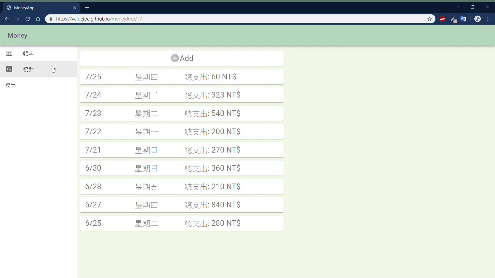

# Money App
運用react做前端網頁框架，並以firebase來做資料庫的存取使用。

## DEMO

[Money App demo site](https://valuejoe.github.io/moneyApp/)

#### 登入、註冊、登出展示
 

#### 新增帳目、刪除帳目展示
 

 #### 統計頁面展示
 

 #### 手機畫面展示
 

## 功能
- 註冊
- 登入
- 登出
- 新增帳目
- 刪除帳目
- 顯示七天、本周及本月的帳目統計
- 支援RWD

## 主要運用工具
- webpack：主要的開發打包工具
- react：本系統的前端框架
- redux：本地端資料傳輸的API
- material-ui：系統UI框架
- firebase：主要的資料庫系統
- react-swipeable-views：呈現螢幕左右滑動換頁的效果
- recharts：統計表所使用的API
- axios：用來處理系統與firebase API的連接
